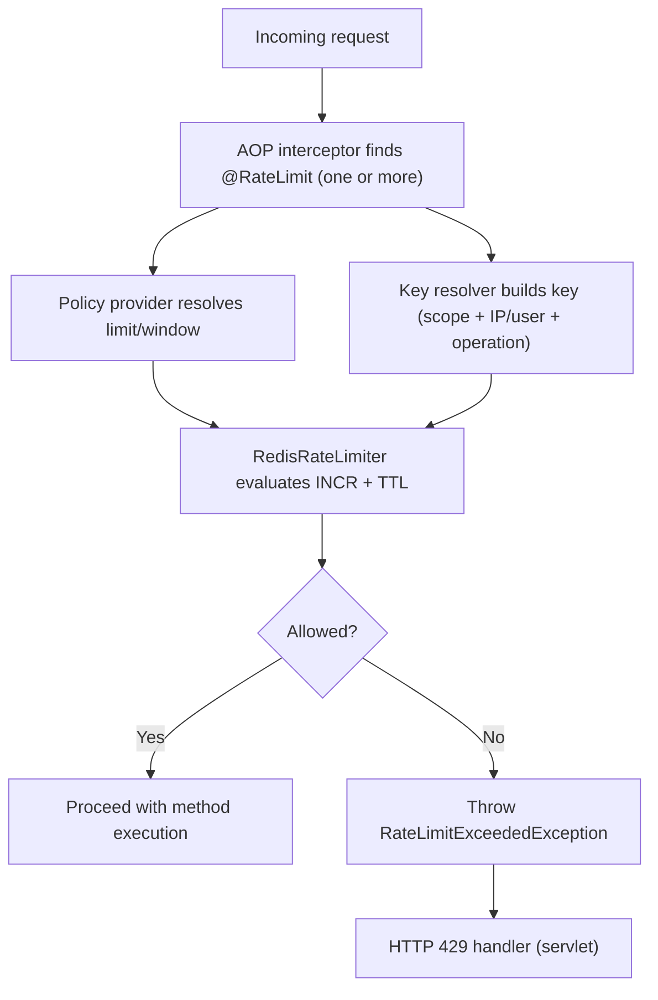

# Spring Boot Redis RateLimiter Starter

[](https://central.sonatype.com/artifact/io.github.v4run-sharma/spring-boot-starter-redis-ratelimiter)
[](https://github.com/V4run-Sharma/spring-boot-starter-redis-ratelimiter/actions/workflows/ci.yml)


[](LICENSE)

A lightweight Spring Boot starter for annotation-driven rate limiting backed by Redis.

This starter provides a production-focused, log-and-metrics-friendly approach to request throttling and complements API Gateway-level rate limiting by enabling method-level protection inside services.

## Table of Contents

- [Features](#features)
- [Why This Starter](#why-this-starter)
- [Requirements](#requirements)
- [Quick Start](#quick-start)
  - [1. Add Dependency](#1-add-dependency)
  - [2. Configure Redis](#2-configure-redis)
  - [3. Add `@RateLimit` to Service Methods](#3-add-ratelimit-to-service-methods)
- [Scopes and Keying](#scopes-and-keying)
- [Per-IP and Per-User Limits](#per-ip-and-per-user-limits)
- [Stacking Limits](#stacking-limits)
- [Custom Key Resolver](#custom-key-resolver)
- [Class-Level Annotation](#class-level-annotation)
- [What Happens When the Limit Is Exceeded](#what-happens-when-the-limit-is-exceeded)
- [Configuration](#configuration)
- [Metrics](#metrics)
- [How It Works](#how-it-works)
- [Quick Validation Checklist](#quick-validation-checklist)
- [Testing](#testing)
- [Compatibility](#compatibility)
- [Upgrading from 1.x](#upgrading-from-1x)
- [Relationship to API Gateway Rate Limiting](#relationship-to-api-gateway-rate-limiting)
- [Release to Maven Central](#release-to-maven-central)
- [License](#license)
- [Contributing](#contributing)

## Features

- `@RateLimit` annotation for method-level and class-level throttling
- Built-in `GLOBAL`, per-`IP`, and per-`USER` scopes; an unknown scope fails the build
- Stackable limits (for example per IP and per user on the same method)
- Redis fixed-window implementation using `INCR` + TTL (no Lua scripts)
- Automatic Spring Boot 3.x auto-configuration (no manual AOP wiring)
- HTTP `429` mapping with optional `Retry-After` and `RateLimit-*` headers
- Pluggable key resolution strategy (`RateLimitKeyResolver`)
- Pluggable policy resolution strategy (`RateLimitPolicyProvider`)
- Configurable backend behavior (`fail-open` or `fail-closed`)
- Micrometer metrics support for allowed, blocked, and error outcomes
- Test setup split between unit tests and Docker-backed integration tests

## Why This Starter

In distributed systems, not all limits belong at the edge. Internal service methods often need their own protection based on business keys, tenants, users, or operation type.

This starter standardizes method-level rate limiting so teams avoid duplicating AOP, Redis keying logic, HTTP handling, and metrics wiring in every service.

## Requirements

- Java 17+
- Spring Boot 3.x
- Redis reachable from your app

## Quick Start

### 1. Add Dependency

Available on [Maven Central](https://central.sonatype.com/artifact/io.github.v4run-sharma/spring-boot-starter-redis-ratelimiter).

Maven (`pom.xml`):

```xml
<dependency>
  <groupId>io.github.v4run-sharma</groupId>
  <artifactId>spring-boot-starter-redis-ratelimiter</artifactId>
  <version>2.0.0</version>
</dependency>
```

Gradle:

```gradle
implementation("io.github.v4run-sharma:spring-boot-starter-redis-ratelimiter:2.0.0")
```

### 2. Configure Redis

`application.yml`:

```yaml
spring:
  data:
    redis:
      host: localhost
      port: 6379
```

Local Redis with Docker:

```bash
docker run --name redis-ratelimiter -p 6379:6379 -d redis:7-alpine
```

### 3. Add `@RateLimit` to Service Methods

```java
import io.github.v4runsharma.ratelimiter.annotation.RateLimit;
import io.github.v4runsharma.ratelimiter.model.RateLimitScope;
import java.util.concurrent.TimeUnit;
import org.springframework.stereotype.Service;

@Service
public class BillingService {

  @RateLimit(
      name = "invoice-create",
      scope = RateLimitScope.GLOBAL,
      limit = 10,
      duration = 1,
      timeUnit = TimeUnit.MINUTES
  )
  public String createInvoice(String accountId) {
    return "ok";
  }
}
```

## Scopes and Keying

`scope` is a `RateLimitScope` enum, so a scope that doesn't exist fails compilation.

| Scope | One bucket per | Default key |
|---|---|---|
| `GLOBAL` (default) | operation, shared by all callers | `global:<operation>` |
| `IP` | client IP address | `ip:<client-ip>:<operation>` |
| `USER` | authenticated user | `user:<principal-name>:<operation>` |

`<operation>` is the annotation's `key` if set, otherwise `fully.qualified.ClassName#methodName`. In Redis, keys are additionally prefixed with `ratelimiter.redis-key-prefix` and suffixed with the window start.

## Per-IP and Per-User Limits

`IP` and `USER` read the HTTP request bound to the current thread (Spring MVC):

- `IP` uses `HttpServletRequest#getRemoteAddr()`. IPv6 addresses are grouped by their /64 prefix, because one client usually controls a whole /64 and could otherwise rotate addresses.
- `USER` uses `HttpServletRequest#getUserPrincipal()`, which Spring Security sets for authenticated users. Anonymous requests have no principal.

Behind a load balancer, ingress, or API gateway, `getRemoteAddr()` returns the proxy's address, so every client would share one bucket. Enable forwarded-header handling so it returns the real client:

```properties
server.forward-headers-strategy=native
```

Only trust forwarded headers set by your own proxies. The starter never reads `X-Forwarded-For` itself, because clients can forge it to dodge IP limits.

Instead of silently skipping the limit, `IP` and `USER` throw `IllegalStateException` (HTTP 500) when:

- No HTTP request is bound to the thread (`@Async`, `@Scheduled`, message listeners, WebFlux).
- `USER` is used on a request without an authenticated principal.

Use `USER` on endpoints that require authentication, and `IP` on public ones such as login or signup.

## Stacking Limits

Repeat `@RateLimit` to apply several limits; every one must pass. Limits are enforced in declaration order, and the first denial stops the call without charging the remaining limits.

```java
@RateLimit(name = "orders-per-ip", scope = RateLimitScope.IP, limit = 100, duration = 1, timeUnit = TimeUnit.MINUTES)
@RateLimit(name = "orders-per-user", scope = RateLimitScope.USER, limit = 20, duration = 1, timeUnit = TimeUnit.MINUTES)
public Order createOrder(OrderRequest request) {
  // ...
}
```

Per-IP limits catch one source hammering many accounts; per-user limits catch one account spread across many IPs. Give stacked limits distinct names so the `429` response and metrics show which one tripped.

## Custom Key Resolver

For identities the built-in scopes don't cover (tenant, API key, account), implement `RateLimitKeyResolver` as a Spring bean. The resolver decides the whole key; `scope` then only labels metrics.

```java
import io.github.v4runsharma.ratelimiter.core.RateLimitContext;
import io.github.v4runsharma.ratelimiter.key.RateLimitKeyResolver;
import org.springframework.stereotype.Component;

@Component
public class TenantKeyResolver implements RateLimitKeyResolver {
  @Override
  public String resolveKey(RateLimitContext context) {
    String tenantId = String.valueOf(context.getArguments()[0]); // Example: first argument is the tenant ID
    return "tenant:" + tenantId + ":" + context.getMethod().getName();
  }
}
```

Use it in the annotation:

```java
@RateLimit(
    name = "report-per-tenant",
    keyResolver = TenantKeyResolver.class,
    limit = 5,
    duration = 1,
    timeUnit = TimeUnit.MINUTES
)
public Report generateReport(String tenantId) {
  // ...
}
```

## Class-Level Annotation

A class-level `@RateLimit` applies to every public method of the bean except `toString`, `equals`, and `hashCode`. Each method gets its own bucket unless `key` is set, in which case they share one.

Method-level annotations replace class-level ones for that method, and an overriding method's annotations replace the inherited method's.

## What Happens When the Limit Is Exceeded

In Spring MVC (Servlet apps), the starter returns:

- HTTP `429 Too Many Requests`
- RFC7807 `ProblemDetail` body
- Optional headers: `Retry-After`, `RateLimit-Limit`, `RateLimit-Remaining`, `RateLimit-Reset`

Example response body:

```json
{
  "type": "about:blank",
  "title": "Rate limit exceeded",
  "status": 429,
  "detail": "Rate limit exceeded: invoice-create (limit=10, window=PT1M, remaining=34000)",
  "timestamp": "2026-02-27T12:00:00Z",
  "key": "global:com.example.BillingService#createInvoice",
  "limit": 10,
  "windowSeconds": 60,
  "name": "invoice-create",
  "retryAfterSeconds": 34
}
```

`Retry-After` and `RateLimit-Reset` are rounded up to whole seconds.

When a `RateLimitExceededException` is thrown, it is mapped automatically by the starter's exception handler in servlet apps.

## Configuration

All properties are optional.

| Property | Default | Description |
|---|---|---|
| `ratelimiter.enabled` | `true` | Master feature toggle for starter auto-configuration. |
| `ratelimiter.redis-key-prefix` | `ratelimiter` | Prefix used for Redis bucket keys. |
| `ratelimiter.fail-open` | `false` | If `true`, allows requests when Redis is unavailable. |
| `ratelimiter.include-http-headers` | `true` | Adds `Retry-After` and `RateLimit-*` headers to `429` responses. |
| `ratelimiter.metrics-enabled` | `true` | Enables Micrometer metrics recorder when a registry is present. |

Example:

```properties
ratelimiter.enabled=true
ratelimiter.redis-key-prefix=ratelimiter
ratelimiter.fail-open=false
ratelimiter.include-http-headers=true
ratelimiter.metrics-enabled=true
```

## Metrics

When Micrometer is available and enabled:

- `ratelimiter.requests` counter
- `ratelimiter.errors` counter
- `ratelimiter.evaluate.latency` timer

Useful metric tags:

- `name`
- `scope`
- `outcome` (`allowed` or `blocked`)
- `exception` (for the error metric)

## How It Works



Rate limiting works through Spring AOP proxies, so calls from within the same class (`this.method()`) are not rate limited.

## Quick Validation Checklist

1. Start Redis.
2. Start your Spring Boot app.
3. Hit a `@RateLimit`-protected endpoint repeatedly.
4. Confirm HTTP `429` once the threshold is crossed.
5. Confirm Redis keys are created with your configured prefix.
6. Confirm metrics appear in your meter registry.

## Testing

- Unit tests: `mvn test`
- Integration tests (Testcontainers): `mvn verify -DrunITs=true`

Notes:

- Integration tests live in `*IT` classes and run through Maven Failsafe.
- Local integration testing requires a running Docker engine (for example Docker Desktop on macOS).

## Compatibility

- Java 17+
- Spring Boot 3.x
- Redis (tested with Redis 7 via Testcontainers image)

## Upgrading from 1.x

- `scope` is now a `RateLimitScope` enum: replace `scope = "USER"` with `scope = RateLimitScope.USER`, or drop it for `GLOBAL`.
- `IP` and `USER` now identify the caller (in 1.x they were labels and all callers shared one bucket). Their Redis keys change, and they require an HTTP request; see [Per-IP and Per-User Limits](#per-ip-and-per-user-limits).
- Class-level `@RateLimit` now applies to all methods of the class. In 1.x it only took effect on methods that were also annotated.
- Custom `RateLimitPolicyProvider` implementations must pass a `RateLimitScope` to `RateLimitPolicy`.

## Relationship to API Gateway Rate Limiting

This starter does not replace gateway throttling. It is intended to:

- Complement edge limits with in-service business limits
- Protect expensive internal operations
- Enforce operation-specific throttles near business logic

## Release to Maven Central

Published through the [Sonatype Central Portal](https://central.sonatype.com/) with `central-publishing-maven-plugin`.

Prerequisites:

- Verified namespace `io.github.v4run-sharma` in the Central Portal
- A Portal user token (Central Portal → Account → Generate User Token)
- A GPG key, with its public key uploaded to a keyserver (for example `keys.openpgp.org`)

`~/.m2/settings.xml`:

```xml
<settings>
  <servers>
    <server>
      <id>central</id>
      <username>${env.CENTRAL_TOKEN_USERNAME}</username>
      <password>${env.CENTRAL_TOKEN_PASSWORD}</password>
    </server>
  </servers>
</settings>
```

Release steps:

1. Set the release version in `pom.xml` and in this README's dependency snippets, and date the entry in `CHANGELOG.md`.
2. Run the full test suite, sign, and publish (requires Docker for the integration tests):

   ```bash
   mvn -DperformRelease=true -DrunITs=true clean deploy
   ```

3. Commit, then tag and push the release: `git tag vX.Y.Z && git push origin vX.Y.Z`.

`autoPublish` is enabled, so a deployment that passes validation goes live on Maven Central without a manual step, and published versions can't be changed or removed. To review first, set `<autoPublish>false</autoPublish>` and publish from the Portal's Deployments page. New versions usually take up to 30 minutes to appear on Maven Central.

## License

Apache License 2.0

## Contributing

Issues and pull requests are welcome.
